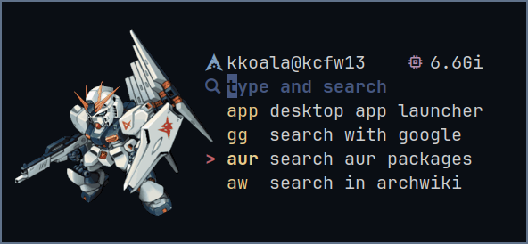
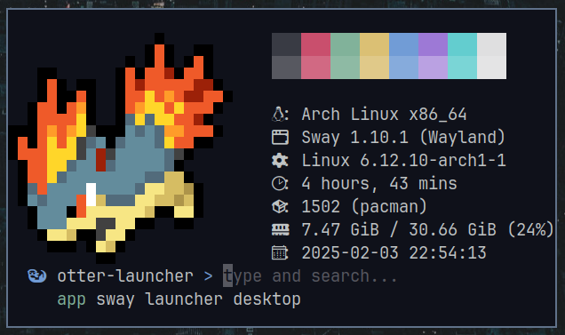

# otter-launcher



A very hackable app launcher, designed for keyboard-centric wm users. It is blazingly fast, supports vi and emacs keybinds, and can be decorated with ascii color codes, sixel or kitty image protocols. Plus, through bash scripting, system info widgets can be added to the infinity.

The core concept is making these behaviours possible:

- type "gg margaret thatcher" to google the lady in a web browser
- "sh htop" to run htop in a terminal
- "dc linux" to search the word linux with an online dictionary
- "app" to launch application menu
- etc.

Some helper scripts can be found in the [contrib](https://github.com/kuokuo123/otter-launcher/tree/main/contrib) folder. Also, it's recommended to setup [sway-launcher-desktop](https://github.com/Biont/sway-launcher-desktop) as a module to launch desktop apps. Use your wm's window rules to control its window size.

Demo for a integrated workflow with tui programs:


Demo for list selection and external editor:


# Features

- modularized to run different commands (via configuration)
- vi and emacs keybinds, with motions for list selection
- two suggestion modes: list & hint
- tab completion
- edit prompt in an external editor (vim, emacs, etc.)
- customizable shell by which programs are launched (sh -c, zsh -c, hyprctl dispatch exec, etc)
- url encoding for web searching
- supporting ascii color codes, chafa, sixel or kitty image protocol, etc.
- loop mode
- cheat sheet for configured modules
- able to show any sys info (by scripting interface.header_cmd)
- callback function (per-module callback can be scripted in module.cmd )
- minimalist, blazingly fast, keyboard-centric

# Installation

## Building from source

### 1. Compile otter-launcher from the repo and place it in your PATH

```
git clone https://github.com/kuokuo123/otter-launcher /tmp/otter-launcher
cd /tmp/otter-launcher
cargo build --release
sudo cp /tmp/otter-launcher/target/release/otter-launcher /usr/bin/
```

### 2. Create a config.toml

Otter-launcher reads from $HOME/.config/otter-launcher/config.toml. If that file is missing, it looks into /etc/otter-launcher/config.toml

An example config file is at [config_example](https://github.com/kuokuo123/otter-launcher/tree/main/config_example). Copy it to one of the above locations. Also, check [more examples of module config](https://github.com/kuokuo123/otter-launcher/wiki) at the wiki page.

# Configuration

``` toml
[general]
default_module = "gg" # The module to run when no prefix is matched
empty_module = "app" # run with an empty prompt
exec_cmd = "sh -c" # The exec command of your shell, default to sh
# for example: "bach -c" for bash; "zsh -c" for zsh. This can also runs wm exec commands, like hyprctl dispatch exec
vi_mode = false # set true to use vi keybinds, false to use emacs keybinds; default to emacs
esc_to_abort = true # allow to quit with esc keypress; a useful option for vi users
cheatsheet_entry = "?" # when entered, otter-launcher will show a list of configured modules
cheatsheet_viewer = "less -R; clear" # the program that otter-launcher will pipe cheatsheet into
clear_screen_after_execution = false # useful when chafa image flash back after module execution
loop_mode = false # in loop mode, otter-launcher won't quit after running a module, useful when using scratchpad
external_editor = "" # if set, pressing ctrl+e (or pressing v in vi normal mode) will edit the input field in the specified program; default to no external editor
#callback = "" # if set, otter-launcher will run the command after a module is executed; for example, it can call swaymsg to adjust window size


# ASCII color codes are allowed with these options. However, \x1b should be replaced with \u001B (unicode escape) because the rust toml crate cannot read \x as an escaped character...
[interface]
header_cmd = "" # Run a shell command and make the stdout printed above the header
header_cmd_trimmed_lines = 0 # Remove a number of lines from header_cmd output, in case of some programs printing excessive empty lines at the end of its output
# use three quotes to write longer commands
header = """
  \u001B[34m \u001B[0m otter-launcher \u001B[34m>\u001B[0m """
header_concatenate = false # print header and header_cmd output at the same line, default to false
list_prefix = "     "
selection_prefix = "   > "
place_holder = "type and search"
default_module_message = "" # if set, the text will be shown when the default module is in use
empty_module_message = "" # the text to show when empty module is in use
suggestion_mode = "list" # available options: list, hint
suggestion_lines = 1 # length of the suggestion list, set to 0 to disable suggestions and tab completion
indicator_with_arg_module = "" # a sign showing whether the module should run with an argument
indicator_no_arg_module = ""
prefix_padding = 0 # format prefixes to have a unified width; prefixes will be padded with spaces to have a least specified number of chars
# below color options affect all modules; per-module coloring is allowed by using ascii color codes at each module's configurations
prefix_color = "\u001B[33m"
description_color = "\u001B[38m"
place_holder_color = "\u001B[30m"
hint_color = "\u001B[30m" # the color of hint mode suggestions


# Modules are defined as followed
[[modules]]
description = "search with google"
prefix = "gg"
cmd = "setsid -f xdg-open 'https://www.google.com/search?q={}'"
with_argument = true # If "with_argument" is true, the {} in the cmd value will be replaced with user input. If the field is not explicitly set, will be taken as false.
url_encode = true # "url_encode" should be true if the module is set to call webpages, as this ensures special characters in url being readable to browsers. It'd better be false with shell scripts. If the field is not explicitly set, will be taken as false.

[[modules]]
description = "launch desktop applications with fzf"
prefix = "app"
cmd = """
desktop_file() {
find /usr/share/applications -name "*.desktop" 2>/dev/null
find /usr/local/share/applications -name "*.desktop" 2>/dev/null
find "$HOME/.local/share/applications" -name "*.desktop" 2>/dev/null
find /var/lib/flatpak/exports/share/applications -name "*.desktop" 2>/dev/null
find "$HOME/.local/share/flatpak/exports/share/applications" -name "*.desktop" 2>/dev/null
}
selected="$(desktop_file | sed 's/.desktop$//g' | sort | fzf -m -d / --with-nth -1 --reverse --padding 1,3 --prompt 'Launch Apps: ')"
[ -z "$selected" ] && exit
echo "$selected" | while read -r line ; do setsid -f gtk-launch "$(basename $line)"; done
"""

[[modules]]
description = "search github"
prefix = "gh"
cmd = "setsid -f xdg-open https://github.com/search?q='{}'"
with_argument = true
url_encode = true

[[modules]]
description = "cambridge dictionary online"
prefix = "dc"
cmd = "setsid -f xdg-open 'https://dictionary.cambridge.org/dictionary/english/{}'"
with_argument = true
url_encode = true

# fzf and fd are needed to run these functions
[[modules]]
description = "open files with fzf"
prefix = "fo"
cmd = "setsid -f $TERM --class fzf -e sh -c 'fd --type f | fzf | setsid -f xargs -r -I {} xdg-open \"{}\"'"

[[modules]]
description = "open folders with fzf and yazi"
prefix = "yz"
cmd = "setsid -f $TERM --class yazi -e sh -c 'fd --type d | fzf | xargs -r -I {} $TERM -e yazi \"{}\"'"
```

# Examples for Styling

## Default Config


```
[interface]
header = "  \u001B[34m \u001B[0m otter-launcher \u001B[34m>\u001B[0m "
list_prefix = "     "
place_holder = "type and search"
suggestion_mode = "list"
suggestion_lines = 1
indicator_with_arg_module = ""
indicator_no_arg_module = ""
prefix_color = "\u001B[33m"
description_color = "\u001B[38m"
place_holder_color = "\u001B[30m"
```

## Fastfetch & Krabby



```
[interface]
header_cmd = "fastfetch --structure break:break:colors:break:os:shell:wm:kernel:uptime:break --key-type icon --logo-type data --logo \"$(krabby name quilava --no-title)\""
header_cmd_trimmed_lines = 1
header = "  \u001B[31m󰐝\u001B[0m  search \u001B[31m>\u001B[0m "
list_prefix = "     "
place_holder = "type the keyword"
suggestion_mode = "list"
suggestion_lines = 1
indicator_with_arg_module = ""
indicator_no_arg_module = ""
prefix_color = "\u001B[33m"
description_color = "\u001B[38m"
place_holder_color = "\u001B[30m"
```

## Image Protocol with CPU & MEM Indicators


[Image Source: Artist Kat Corrigan & MWMO Stormwater Park](https://www.mwmo.org/learn/visit-us/exhibits/waterways-and-otterways/)

```
[interface]
header_cmd = """
chafa --fit-width $HOME/.config/otter-launcher/waterways_and_otterways.jpg;
echo -e "   \u001B[34m  >\u001B[0m $USER@$HOSTNAME         \u001B[31m\u001B[0m $(mpstat | awk 'FNR ==4 {print $4}')%  \u001B[33m󰍛\u001B[0m $(free -h | awk 'FNR == 2 {print $3}')"
"""
header_cmd_trimmed_lines = 0
header = "      \u001B[34;1m>\u001B[0;1m "
list_prefix = "        "
place_holder = "type and search..."
indicator_with_arg_module = "\u001B[31m^\u001B[0m "
indicator_no_arg_module = "\u001B[31m$\u001B[0m "
default_module_message = """
        \u001B[35msearch\u001B[0m the internet"""
suggestion_mode = "list"
suggestion_lines = 3
prefix_padding = 3
prefix_color = "\u001B[33m"
description_color = "\u001B[38m"
place_holder_color = "\u001B[90m"
```

## Image to the Left


This config uses a hackable [bash script](https://github.com/kuokuo123/otter-launcher/tree/main/contrib/chafa-text.sh) to display an [image of shocked otters](https://github.com/kuokuo123/otter-launcher/tree/main/assets/otter_shocked.webp) and format the layout. Otter-launcher call the script in header_cmd with a line containing system info widges printed beneath the script output.


```
[interface]
header_cmd = """
$HOME/.config/otter-launcher/scripts/chafa-text.sh;
echo -e "\n    \u001B[31;1m#\u001B[0m $USER@$HOSTNAME           \u001B[31m\u001B[0m $(mpstat | awk 'FNR ==4 {print $4}')%  \u001B[33m󰍛\u001B[0m $(free -h | awk 'FNR == 2 {print $3}')"
"""
header_cmd_trimmed_lines = 0
header = "    \u001B[31;1m>\u001B[0;1m "
indicator_with_arg_module = "^ "
indicator_no_arg_module = "$ "
place_holder = "type and search..."
suggestion_mode = "hint"
prefix_color = "\u001B[33m"
description_color = "\u001B[38m"
place_holder_color = "\u001B[90m"
hint_color = "\u001B[90m"
```

## Image to the Right


This config uses [chafa-penguin.sh](https://github.com/kuokuo123/otter-launcher/tree/main/contrib/chafa-penguin.sh) to render a [prinny](https://github.com/kuokuo123/otter-launcher/tree/main/assets/prinny-raisehand.png).

```
[interface]
header_cmd = """
$HOME/.config/otter-launcher/scripts/chafa-penguin.sh;
"""
header = "    │ \u001B[90m\u001B[0m  "
indicator_with_arg_module = ""
indicator_no_arg_module = ""
place_holder = "type & search"
suggestion_mode = "list"
suggestion_lines = 1
list_prefix = "    └ \u001B[34m󱓞  "
prefix_padding = 0
default_module_message = "    └ \u001B[34m󱓞  \u001B[33msearch\u001B[0m the internet"
prefix_color = "\u001B[33m"
description_color = "\u001B[38m"
place_holder_color = "\u001B[90m"

```

# Integration

Otter-launcher can work well with tui programs. When launching them, module.cmd can be scripted to perform functions like adjusting window size.

In the below example, otter-launcher changes window size before and after launching pulsemixer by calling swaymsg:

```
[[modules]]
description = "pulsemixer for audio control"
prefix = "vol"
cmd = "swaymsg [app_id=otter-launcher] resize set width 600 px height 300 px; pulsemixer; swaymsg [app_id=otter-launcher] resize set width 600 px height 60 px"
```

Some recommendations of tui utilities that works really well:

- Desktop app launcher: [sway-launcher-desktop](https://github.com/Biont/sway-launcher-desktop)
- Audio control: [pulsemixer](https://github.com/GeorgeFilipkin/pulsemixer)
- Bluetooth control: [bluetui](https://github.com/pythops/bluetui) [bluetuith](https://github.com/darkhz/bluetuith)
- Wifi control: [nmtui](https://archlinux.org/packages/extra/x86_64/networkmanager/) [impala](https://github.com/pythops/impala)
- Spotify: [spotify_player](https://github.com/aome510/spotify-player)
- Mouse control: [wl-kbptr](https://github.com/moverest/wl-kbptr)

More on [Awesome TUIs](https://github.com/rothgar/awesome-tuis) or [Awesome Command Line(CLI/TUI) Programs](https://github.com/toolleeo/awesome-cli-apps-in-a-csv).
