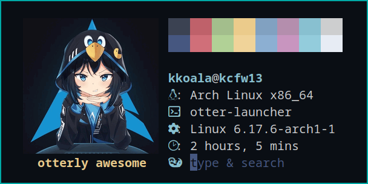
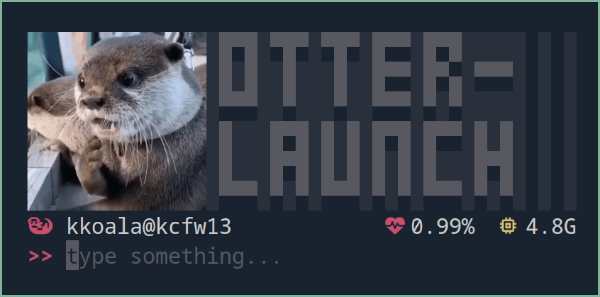
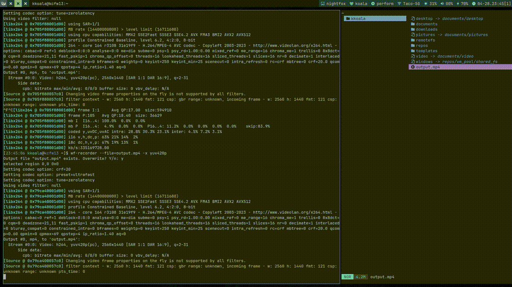
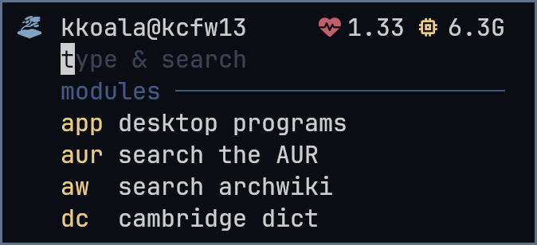
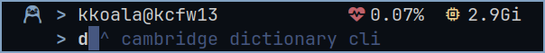
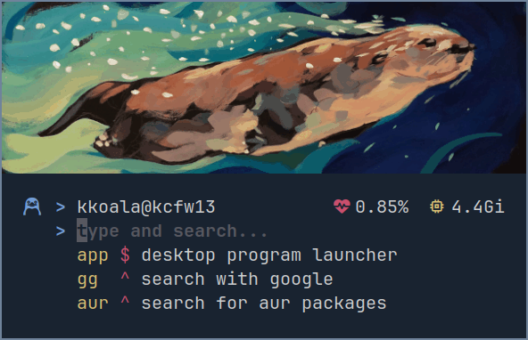
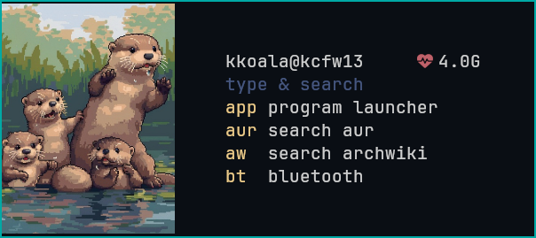
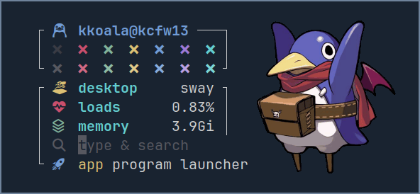

<div align="center">


*minimalist, blazingly fast, keyboard-centric*

  
  

</div>

<div align="center">




</div>

## Overview

A very hackable app launcher, designed for keyboard-centric wm users. It is blazingly fast, supports vi and emacs keybinds, and can be decorated with ansi color codes, sixel or kitty image protocols. Plus, through bash scripting, system info widgets can be added to the infinity.

The core concept is making these behaviours possible:

- type "gg margaret thatcher" to google the lady in a web browser
- "sh htop" to run htop in a terminal
- "dc linux" to search the word linux with an online dictionary
- "app" to launch application menu
- etc.

Some helper scripts can be found in the [contrib](https://github.com/kuokuo123/otter-launcher/tree/main/contrib) folder, modules in [wiki](https://github.com/kuokuo123/otter-launcher/wiki).

## Features

- modularized to run different commands
- vi and emacs keybinds
- two suggestion modes: list & hint
- tab completion; tab again to undo completion
- edit prompt in an external editor (vim, emacs, etc.)
- url encoding for web searching
- supporting ansi codes, chafa, sixel or kitty image protocol, etc.
- overlay layer to show chafa image
- cheat sheet
- callback function
- customizable shell by which programs are launched (sh -c, zsh -c, hyprctl dispatch exec, etc)
- minimalist, blazingly fast, keyboard-centric

<div align="center">



</div>

## Table of Contents

- [Overview](#overview)
- [Features](#features)
- [Demo](#demo)
- [Installation](#installation)
- [Configuration](#configuration)
- [Integration](#integration)
- [Stylling](#styling)

## Demo

> Workflow

<div align="center">


</div>

>External editor, list selection, and cheatsheet

<div align="center">



</div>

## Installation

### AUR

Install with AUR helpers

```
paru -S otter-launcher
```

### Building from source

1. Compile from source code

```
git clone https://github.com/kuokuo123/otter-launcher /tmp/otter-launcher
cd /tmp/otter-launcher
cargo build --release
sudo cp /tmp/otter-launcher/target/release/otter-launcher /usr/bin/
```

2. Create a config file mannually

Put a config at $HOME/.config/otter-launcher/config.toml. The [default config](https://github.com/kuokuo123/otter-launcher/tree/main/config_example/config.toml) looks for /etc/otter-launcher/[pikachu.example](https://github.com/kuokuo123/otter-launcher/tree/main/config_example/pikachu.example) to show a chafa image. You can modify the config file to remove this line from overlay_cmd.

## Configuration

Otter reads from $HOME/.config/otter-launcher/config.toml. If missing, it looks into /etc/otter-launcher/config.toml, which is included in the AUR installation.

The default config comes with a [capybara](https://github.com/kuokuo123/otter-launcher/tree/main/config_example/pikachu.example) to demonstrate how image integration works. Remove it by modifying overlay_cmd in the config file.

<div align="center">



</div>

The confing has four sections:

- [general] includes generic options
- [interface] includes options related to user interface
- [overlay] includes options releated to image integration
- [[modules]] can be configured through bash scripting in an unlimited number

All the available options are listed below. Check [more examples for module config](https://github.com/kuokuo123/otter-launcher/wiki) at the wiki page.

``` toml
[general]
default_module = "gg" # module to run when no prefix is matched
empty_module = "app" # run with an empty prompt
exec_cmd = "sh -c" # exec command of your shell
# for example: "bach -c" for bash; "zsh -c" for zsh; also accept wm commands like "hyprctl dispatch exec"
vi_mode = false # set true to use vi keybinds, false emacs keybinds
esc_to_abort = true # useful for vi users
cheatsheet_entry = "?" # when prompted, will show a list of configured modules
cheatsheet_viewer = "less -R; clear" # command to show cheatsheet; through piping stdout
clear_screen_after_execution = false
loop_mode = false # don't quit after executing a module, useful with scratchpads; stderr is hidden in loop mode
external_editor = "vi" # if set, press ctrl+x ctrl+ee (or v in vi normal mode) to edit prompt in the specified program
delay_startup = 0 # sometimes the otter runs too fast even before the terminal window is ready; this slows it down by milliseconds; useful when chafa image is skewed
#callback = "" # if set, will run after module execution; for example, calling swaymsg to adjust window size


# ANSI color codes are allowed. However, \x1b should be replaced with \u001B, because the rust toml crate cannot read \x as an escaped character
[interface]
# use three quotes to write longer codes
header = """
  \u001B[34;1m$USER@$(printf $HOSTNAME)\u001B[0m     \u001B[31m\u001B[0m $(mpstat | awk 'FNR ==4 {print $4}')
  """
header_cmd = "" # run a command and print stdout above the header
header_cmd_trimmed_lines = 0 # remove trailing lines from header_cmd output, in case of some programs appending excessive empty lines
place_holder = "otterly awesome" # at the input field
suggestion_mode = "list" # available options: list, hint
separator = "                  \u001B[90mmodules ────────────────" # add a line between intput field and suggestion list; only effective in list mode
footer = "" # add a line after suggestion list
suggestion_lines = 3 # 0 to disable suggestions and tab completion
list_prefix = "  "
selection_prefix = "\u001B[31;1m▌ "
prefix_padding = 3 # format prefixes to have a uniformed width
default_module_message = "  \u001B[33msearch\u001B[0m the internet" # shown when the default module is in use
empty_module_message = "" # shown when the empty module is in use
customized_list_order = false # false to list modules alphabetically; true to list as per the configured order in the below [[modules]] section
indicator_with_arg_module = "" # the sign showing whether a module should run with an argument
indicator_no_arg_module = ""
# below color options affect all modules; per-module coloring can be configured using ansi codes individually
prefix_color = "\u001B[33m"
description_color = "\u001B[39m"
place_holder_color = "\u001B[30m"
hint_color = "\u001B[30m" # suggestion color in hint mode
# move the interface rightward or downward
move_interface_right = 16
move_interface_down = 1


# overlay is a floating layer that can be printed with stdout and moved around; useful for integrating chafa images
[overlay]
# run a command and print stdout on the overlay layer
overlay_cmd = """
cat /etc/otter-launcher/pikachu.example \
|| echo -e "The file pickachu.example is not found. Pikachu can be at the below blank area. Fix this by modifying the overlay_cmd option in your config file.\n\n"
"""
overlay_trimmed_lines = 0 # remove trailing lines from overlay_cmd output
overlay_height = 0 # set overlay size; 0 to be auto; 1 is one line, 2 two lines, etc; kitty & sixel image size can be determined automatically; others should be set mannually; try modify this whenever you meet issues releated to image height
move_overlay_right = 0 # move the overlay layer around for theming
move_overlay_down = 0


# modules are defined as followed
[[modules]]
description = "google search"
prefix = "gg"
cmd = "xdg-open https://www.google.com/search?q='{}'"
with_argument = true # if true, {} in cmd will be replaced with user input. if not explicitly set, taken as false.
url_encode = true # should be true when calling webpages; this ensures special characters in url being readable to browsers; taken as false if not explicitly set
unbind_proc = true # run cmd in a forked shell as opposed to as a child process (simply by prepending setsid -f to the configured cmd); useful for launching gui programs; taken as false if not explicitly set; try wm's exec command for unbinding if this option goes wrong (like swaymsg exec)

# fzf is needed to run below functions
[[modules]]
description = "desktop programs"
prefix = "app"
cmd = """
desktop_file() {
find /usr/share/applications -name "*.desktop" 2>/dev/null
find /usr/local/share/applications -name "*.desktop" 2>/dev/null
find "$HOME/.local/share/applications" -name "*.desktop" 2>/dev/null
find /var/lib/flatpak/exports/share/applications -name "*.desktop" 2>/dev/null
find "$HOME/.local/share/flatpak/exports/share/applications" -name "*.desktop" 2>/dev/null
}
selected="$(desktop_file | awk -F/ '{name=$NF; sub(/\.desktop$/, "", name); print name}' | sort -k1,1 | cut -f2- | fzf --reverse --padding 1,3 --info-command 'echo -e " desktop apps ($FZF_POS/$FZF_TOTAL_COUNT)"' --cycle --gutter " " --pointer " ▌" --color "bg+:-1,pointer:1,info:8,separator:8,scrollbar:0" --prompt '  ' -m -d / --with-nth -1 )"
[ -z "$selected" ] && exit
echo "$selected" | while read -r line ; do setsid -f gtk-launch "$(basename $line)"; done
"""

[[modules]]
description = "power menu (fzf)"
prefix = "po"
cmd = """
function power {
if [[ -n $1 ]]; then
case $1 in
"logout") session=`loginctl session-status | head -n 1 | awk '{print $1}'`; loginctl terminate-session $session ;;
"suspend") systemctl suspend ;;
"hibernate") systemctl hibernate ;;
"reboot") systemctl reboot ;;
"shutdown") systemctl poweroff ;;
esac fi }
power $(echo -e 'reboot\nshutdown\nlogout\nsuspend\nhibernate' | fzf --reverse --padding 1,2 --info-command 'printf " power menu ($FZF_POS/$FZF_TOTAL_COUNT)"' --cycle --gutter " " --pointer " ▌" --color "bg+:-1,pointer:1,info:8,separator:8,scrollbar:0" --prompt '  ' | tail -1)
"""

[[modules]]
description = "run commands"
prefix = "sh"
cmd = """
$(printf $TERM | sed 's/xterm-//g') -e sh -c "{}"
"""
with_argument = true
unbind_proc = true

[[modules]]
description = "search archwiki"
prefix = "aw"
cmd = "xdg-open https://wiki.archlinux.org/index.php?search='{}'"
with_argument = true
url_encode = true
unbind_proc = true

[[modules]]
description = "search packages"
prefix = "pac"
cmd = "xdg-open https://archlinux.org/packages/?q='{}'"
with_argument = true
url_encode = true
unbind_proc = true

[[modules]]
description = "search the AUR"
prefix = "aur"
cmd = "xdg-open https://aur.archlinux.org/packages?K='{}'"
with_argument = true
url_encode = true
unbind_proc = true

[[modules]]
description = "cambridge dict"
prefix = "dc"
cmd = "xdg-open 'https://dictionary.cambridge.org/dictionary/english/{}'"
with_argument = true
url_encode = true
unbind_proc = true

[[modules]]
description = "open files (fzf)"
prefix = "fo"
cmd = """
find $HOME -type f -not -path '*/.cache/*' 2>/dev/null | fzf --reverse --padding 1,3 --info-command 'printf " files ($FZF_POS/$FZF_TOTAL_COUNT)"' --cycle --gutter ' ' --pointer ' ▌' --color 'bg+:-1,pointer:1,info:8,separator:8,scrollbar:0' --prompt '  ' | setsid -f xargs -r -I [] xdg-open '[]'
"""

[[modules]]
description = "open dirs (yazi)"
prefix = "yz"
cmd = """
find $HOME -type d -not -path '*/.cache/*' 2>/dev/null | fzf --reverse --padding 1,3 --info-command 'printf " directories ($FZF_POS/$FZF_TOTAL_COUNT)"' --cycle --gutter ' ' --pointer ' ▌' --color 'bg+:-1,pointer:1,info:8,separator:8,scrollbar:0' --prompt '  ' | xargs -r -I [] setsid -f "$(echo $TERM | sed 's/xterm-//g')" -e yazi '[]'
"""

[[modules]]
description = "ChatGPT prompt"
prefix = "gpt"
with_argument = true
unbind_proc = true
cmd = """
function chat {
  encoded="$(jq -sRr @uri)"
  exec xdg-open "https://chat.openai.com/?prompt=$encoded"
}
chat <<'EOF'
{}
EOF
"""
```

## Integration

Otter-launcher works well with tui, cli programs, and bash pipelines. Some tricktips:

1. Use your wm's window rules to control its window size, and make it large enough to contain the printed content to prevent a skewed layout.

2. [[modules]].cmd can be scripted to adjust window sizes. For example:

``` toml
[[modules]]
description = "pulsemixer for audio control"
prefix = "vol"
cmd = "swaymsg [app_id=otter-launcher] resize set width 600 px height 300 px; pulsemixer; swaymsg [app_id=otter-launcher] resize set width 600 px height 60 px"
```

3. Check out the [wiki page](https://github.com/kuokuo123/otter-launcher/wiki) to see more integration examples, like vpn, ppd, cups, wifi, etc.

4. Some tui utilities that works really well:

    - Desktop app launcher: [sway-launcher-desktop](https://github.com/Biont/sway-launcher-desktop) [fsel](https://github.com/Mjoyufull/fsel)
    - Audio control: [pulsemixer](https://github.com/GeorgeFilipkin/pulsemixer)
    - Bluetooth control: [bluetui](https://github.com/pythops/bluetui) [bluetuith](https://github.com/darkhz/bluetuith)
    - Wifi control: [nmtui](https://archlinux.org/packages/extra/x86_64/networkmanager/) [impala](https://github.com/pythops/impala)
    - Spotify: [spotify_player](https://github.com/aome510/spotify-player)
    - Mouse control: [wl-kbptr](https://github.com/moverest/wl-kbptr)
    - More on [Awesome TUIs](https://github.com/rothgar/awesome-tuis) or [Awesome Command Line(CLI/TUI) Programs](https://github.com/toolleeo/awesome-cli-apps-in-a-csv).

5. It's recommended to setup a dedicated desktop app launcher as a module, like [fsel](https://github.com/Mjoyufull/fsel) (rust and very fast) or [sway-launcher-desktop](https://github.com/Biont/sway-launcher-desktop) (bash speed). The default config is just a simple script finding into regular directories and flatpak. If your apps are from different sources, it won't show.

6. If you want to change the window size of the external editor, call a wrapper script at general.external_editor. Examples of such a wrapper are in the [contrib](https://github.com/kuokuo123/otter-launcher/tree/main/contrib) folder.

7. Running otter in wayland's layer shell surface like rofi is possible, but without perceivable benefit. This should be done through a terminal capable of running in layer shell like kitty, because otter as a tui program can only run within a terminal. Below is an example using [kitten panel](https://sw.kovidgoyal.net/kitty/kittens/panel/) in niri:

```
binds {
        Mod+Space { 
            spawn-sh "pkill otter-launcher || \
            kitten panel -1 \
                --layer=overlay \
                --edge=center-sized \
                --lines=8 \
                --columns=40 \
                --move-to-active-monitor \
                --focus-policy exclusive \
                --app-id=otter-launcher \
                otter-launcher"; }
}
```

8. You can also run otter with general.loop_mode like a daemon, and hide it after command execution using general.callback. However, kitten panel currently has issues with wayland's multi-monitor setup as it cannot unhide layer shell at the focused monitor. An example for such a config in niri:

```
binds {
    Mod+Space {
        spawn-sh "kitten @ \
            --to=unix:/tmp/panel-nchat \
            resize-os-window \
            --action=toggle-visibility || \
        kitten panel \
            -o allow_remote_control=socket-only \
            --listen-on=unix:/tmp/panel-nchat \
            --layer=overlay \
            --edge=center \
            --move-to-active-monitor \
            --focus-policy exclusive \
            --app-id=nchat \
            nchat"; }
}
```

## Styling

### Two Liner in Hint Mode

<div align="center">



</div>

```toml
[interface]
header = """  \u001B[34;1m  >\u001B[0m $USER@$(echo $HOSTNAME)              \u001B[31m\u001B[0m $(cat /proc/loadavg | cut -d ' ' -f 1)  \u001B[33m󰍛\u001B[0m $(free -h | awk 'FNR == 2 {print $3}' | sed 's/i//')\n     \u001B[34;1m>\u001B[0;1m """
indicator_with_arg_module = "^ "
indicator_no_arg_module = "$ "
place_holder = "type and search"
suggestion_mode = "hint"
place_holder_color = "\u001B[90m"
hint_color = "\u001B[90m"
```

### Fastfetch

<div align="center">


</div>

Since v0.6.4 fastfetch in interface.header_cmd is supported. It works without extra settings.

However, fastfetch comes with its own "pipe mode" that sometimes does not pipe colors, so using it in overlay.overlay_cmd should turn an extra switch "fastfetch --pipe false". 

``` toml
[interface]
header_cmd = """
printf "\n"
fastfetch \
    --structure colors:break:title:os:shell:kernel:uptime \
    --logo-print-remaining false \
    --logo-height 8 \
    --logo-padding-left 3 \
    --sixel $HOME/.config/otter-launcher/images/images_squ/archlinux_chan.jpg
"""
header = "   \u001B[33;1m  otterly awesome \u001B[0m  \u001B[36;1m:\u001B[0;1m "
place_holder = "type & search"
suggestion_mode = "hint"
prefix_color = "\u001B[33m"
description_color = "\u001B[39m"
place_holder_color = "\u001B[30m"
hint_color = "\u001B[90m"
```

### Image Protocol

Using chafa in header_cmd to render the image.

<div align="center">



[Image Source: Artist Kat Corrigan & MWMO Stormwater Park](https://www.mwmo.org/learn/visit-us/exhibits/waterways-and-otterways/)

</div>

``` toml
[interface]
header_cmd = "chafa --fit-width $HOME/.config/otter-launcher/images_other/waterways_and_otterways.jpg"
header_cmd_trimmed_lines = 1
header = """  \u001B[34;1m  󱎘 \u001B[0m $USER@$(echo $HOSTNAME)          \u001B[31m\u001B[0m $(cat /proc/loadavg | cut -d ' ' -f 1)  \u001B[33m󰍛\u001B[0m $(free -h | awk 'FNR == 2 {print $3}')\n    \u001B[34;1m󱎘 \u001B[0;1m """
list_prefix = "       "
selection_prefix = "     \u001B[31;1m> "
place_holder = "type and search..."
default_module_message = """
       \u001B[35msearch\u001B[0m on the internet"""
suggestion_mode = "list"
suggestion_lines = 3
prefix_padding = 3
prefix_color = "\u001B[33m"
description_color = "\u001B[39m"
place_holder_color = "\u001B[90m"
hint_color = "\u001B[90m"
```

### Image to the Left

Rendering chafa image by overlay_cmd at the left, moving the inteface to the right.

<div align="center">



</div>

```toml
[overlay]
# render image in overlay layer using chafa
overlay_cmd = "chafa -s x10 $HOME/.config/otter-launcher/image.png"
overlay_trimmed_lines = 1

[interface]
header = "  $USER@$(echo $HOSTNAME)     \u001B[31m\u001B[0m $(free -h | awk 'FNR == 2 {print $3}' | sed 's/i//')\n  "
list_prefix = "  "
selection_prefix = "\u001B[31;1m> "
place_holder = "type & search"
default_module_message = "  \u001B[33msearch\u001B[0m the internet"
suggestion_mode = "list"
suggestion_lines = 4
prefix_padding = 3
prefix_color = "\u001B[33m"
description_color = "\u001B[39m"
place_holder_color = "\u001B[90m"
hint_color = "\u001B[90m"

# move the interface
move_interface_right = 20
move_interface_down = 2
```

### Image to the Right

This config renders a [prinny](https://github.com/kuokuo123/otter-launcher/tree/main/assets/prinny-raisehand.png) using overlay_cmd, and then move the overlay right.

<div align="center">



</div>

```toml
[overlay]
# render image in overlay layer using chafa
overlay_cmd = "chafa -s x10 $HOME/.config/otter-launcher/image.png"
overlay_trimmed_lines = 1

#move overlay rightwards
move_overlay_right = 32

[interface]
# move the interface
move_interface_down = 1

# customized header & list prefix
header = """
    ┌ \u001B[1;34m  $USER@$(echo $HOSTNAME) \u001B[0m───┐
    │ \u001B[90m󱎘  \u001B[31m󱎘  \u001B[32m󱎘  \u001B[33m󱎘  \u001B[34m󱎘  \u001B[35m󱎘  \u001B[36m󱎘\u001B[0m │
    └ \u001B[36m \u001B[1;36m system\u001B[0m archlinux ┘
    ┌ \u001B[33m \u001B[1;36m window \u001B[0m     $XDG_CURRENT_DESKTOP ┐
    │ \u001B[31m \u001B[1;36m loads\u001B[0m       $(cat /proc/loadavg | cut -d ' ' -f 1) │
    │ \u001B[32m \u001B[1;36m memory\u001B[0m     $(free -h | awk 'FNR == 2 {print $3}') │
    │ \u001B[90m\u001B[0m  """
list_prefix = "    └ \u001B[34m󱓞  "
selection_prefix = "    └ \u001B[31m󱓞  "
default_module_message = "    └ \u001B[34m󱓞  \u001B[33msearch\u001B[0m the internet"

place_holder = "type & search"
suggestion_mode = "list"
suggestion_lines = 1
prefix_color = "\u001B[33m"
description_color = "\u001B[39m"
place_holder_color = "\u001B[90m"
hint_color = "\u001B[90m"
```

### Otter Shocked

<div align="center">


</div>

This custom script use ansi control codes to print texts to the right of a sixel [shocked otter](https://github.com/kuokuo123/otter-launcher/tree/main/assets/otter_shocked.webp). Modify the script to suit your needs.

```toml
# delay startup to wait for sixel execution
[general]
delay_startup = 10

[interface]
header_cmd = """

# The path of the image to be displayed
image_file="$HOME/.config/otter-launcher/images/images_other/otter_shocked.webp"

# Set the image's width and height, which decide the position of printed texts
image_width=17
image_height=6

# pad the image with spaces
image_padding_top=1
image_padding_left=2

# The text to be printed should be written between the two "EOF"s
printed_lines=$(cat << EOF
\u001B[90m
░█▀█░▀█▀░▀█▀░█▀▀░█▀█░░░░░ ░ ░
░█░█░░█░░░█░░█▀▀░█▀▄░▀▀▀░ ░ ░
░▀▀▀░░▀░░░▀░░▀▀▀░▀░▀░░░░░ ░ ░
░█░░░█▀█░█░█░█▀█░█▀▀░█░█░ ░ ░
░█░░░█▀█░█░█░█░█░█░░░█▀█░ ░ ░
░▀▀▀░▀░▀░▀▀▀░▀░▀░▀▀▀░▀░▀░ ░ ░
EOF
)

# main function
function chafa-text() {
  # pad printed_lines with empty lines to the height of the image
  line_count=$(echo "$printed_lines" | wc -l)
  additional_lines=$((image_height - line_count))
  for (( i=0; i<additional_lines; i++ )); do
    printed_lines+="\n"
  done
  # Render the image with chafa at the padded position
  if (( $image_padding_top > 0 )); then
    printf '\n%.0s' $(seq 1 $image_padding_top)
  fi
  chafa --size $((image_width))x$((image_height)) "$image_file" | while IFS= read -r line; do
  printf "\u001B[$((image_padding_left))G"
    printf '\u001B[%dG%s\n' "$((image_padding_left + 1))" "$line"
  done
  # Move cursor to the starting line of the image
  printf "\u001B[$((image_height + 1))A"
  # Move each of printed_lines' start position to image_width + 1
  echo -e "$printed_lines" | while IFS= read -r line; do
    printf '\u001B[%dG%s\n' "$((image_width))" "$line"
  done
}

# run the function
chafa-text
"""

header = """
  \u001B[31;1m \u001B[0m $USER@$(echo $HOSTNAME)            \u001B[31m\u001B[0m $(mpstat | awk 'FNR ==4 {print $4}')%  \u001B[33m󰍛\u001B[0m $(free -h | awk 'FNR == 2 {print $3}' | sed 's/i//')
  \u001B[31;1m>>\u001B[0;1m """
indicator_with_arg_module = "$ "
indicator_no_arg_module = "^ "
place_holder = "type something..."
suggestion_mode = "hint"
prefix_color = "\u001B[33m"
description_color = "\u001B[39m"
place_holder_color = "\u001B[30m"
hint_color = "\u001B[90m"
```
