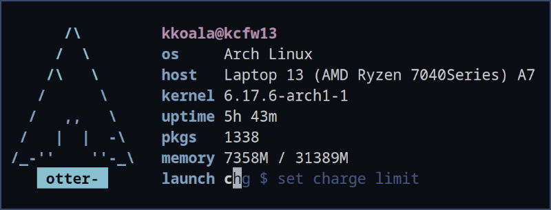

# Otter Launcher


Otter-launcher is a highly extendable commandline program that can launch shell scripts, applications, or arbitrary commands by a few key strokes. It is customizable with ascii color code, sixel or kitty image protocol (depending on the emulator in use), and hence a good companion to keyboard-centric window manager users.

The concept is making behaviours like the below possible:

- type "gg margaret thatcher" to google the lady
- type "sh htop" to run htop in a terminal
- type "dc linux" to search the word linux with an online dictionary
- type "app" to launch sway-launcher-desktop
- etc.

It is recommended to use otter-launcher with [sway-launcher-desktop](https://github.com/Biont/sway-launcher-desktop), making it an application launcher. Use your wm's window rules to control its window size. 


# Features

- modularized prefixes to run different commands (via configuration)
- fuzzy search and tab completion for configured modules
- module-specific prehook and callback commands
- customizable shell or wm by which programs are launched (sh -c, zsh -c, hyprctl dispatch exec, etc)
- url encoding for web searching
- customizable with ascii color codes, chafa, neofetch, etc.
- minimalist, keyboard-centric design

# Installation

## Building from source

```
git clone https://github.com/kuokuo123/otter-launcher /tmp/otter-launcher
cd /tmp/otter-launcher
cargo build --release
sudo cp /tmp/otter-launcher/target/release/otter-launcher /usr/bin/
```

# Configuration

Otter-launcher read a config file from $HOME/.config/otter-launcher/config.toml. If that file is missing, it looks into /etc/otter-launcher/config.toml

An example of the file is at config_example/config.toml in this repo. Copy it to one of the above paths.

``` toml
[general]
default_module = "gg" # The module to run when no prefix is matched
empty_module = "app" # The module to run with an empty prompt
exec_cmd = "sh -c" # The exec command of your shell or window manager, default to bash
# for example: "swaymsg exec" for swaywm; "hyprctl dispatch exec" for hyprland; "zsh -c" for zsh
show_suggestion = true # Fuzzy search for prefixes; autocompletion with TAB


[interface]
# ASCII color codes are allowed with these options. However, \x1b[ should be replaced with \u001B[ (unicode escape) because the rust toml crate cannot read \x as an escaped character...
header_cmd = "" # Run a shell command and make the stdout printed above the header
header_cmd_trimmed_lines = 0 # Remove a number of lines from header_cmd output, in case of some programs printing excessive empty lines at the end of its output
# use three quotes to write longer commands
header = """
\u001B[32m
░█▀█░▀█▀░▀█▀░█▀▀░█▀█░░░░░█░░░█▀█░█░█░█▀█░█▀▀░█░█
░█░█░░█░░░█░░█▀▀░█▀▄░▀▀▀░█░░░█▀█░█░█░█░█░█░░░█▀█
░▀▀▀░░▀░░░▀░░▀▀▀░▀░▀░░░░░▀▀▀░▀░▀░▀▀▀░▀░▀░▀▀▀░▀░▀
            ————————————————————————\u001B[0m
"""
prompt_prefix = "\u001B[34m \u001B[0m otter-launcher \u001B[34m>\u001B[0m"
list_prefix = "    "
highlighted_prefix = " \u001B[31m > \u001B[0m"
scroll_up_prefix = " \u001B[31m ^ \u001B[0m"
scroll_down_prefix = " \u001B[31m v \u001B[0m"
help_message = ""
place_holder = "type and search..."
suggestion_lines = 3


# Modules are defined as followed
[[modules]]
description = "search with google"
prefix = "\u001B[32mgg\u001B[0m"
cmd = "xdg-open 'https://www.google.com/search?q={}'"
with_argument = true # If "with_argument" is true, the {} in the cmd value will be replaced with user input. If the field is not explicitly set, will be taken as false.
url_encode = true # "url_encode" should be true if the module is set to call webpages, as this ensures special characters in url being readable to browsers. It'd better be false with shell scripts. If the field is not explicitly set, will be taken as false.

[[modules]]
description = "launch desktop applications with fzf"
prefix = "\u001B[33mapp\u001B[0m"
prehook = "swaymsg [app_id=otter-launcher] resize set width 650 px height 300 px" # if set, the prehook command will run before the main cmd starts. 
callback = "" # if set, the callback command will run after the main cmd has finished. 
cmd = """

desktop_file() {
find /usr/share/applications -name "*.desktop" 2>/dev/null
find /usr/local/share/applications -name "*.desktop" 2>/dev/null
find "$HOME/.local/share/applications" -name "*.desktop" 2>/dev/null
find /var/lib/flatpak/exports/share/applications -name "*.desktop" 2>/dev/null
find "$HOME/.local/share/flatpak/exports/share/applications" -name "*.desktop" 2>/dev/null
}

selected="$(desktop_file | sed 's/.desktop$//g' | sort | fzf -m -d / --with-nth -1 --reverse --padding 1,3 --prompt 'Launch Apps: ')"

[ -z "$selected" ] && exit
echo "$selected" | while read -r line ; do setsid -f gtk-launch "$(basename $line)"; done

"""

[[modules]]
description = "open files with fzf"
prefix = "\u001B[32mfo\u001B[0m"
cmd = "$TERM --class fzf -e sh -c 'fd --type f | fzf | xargs -r xdg-open'"

[[modules]]
description = "open folders with fzf and yazi"
prefix = "\u001B[32myz\u001B[0m"
cmd = "$TERM --class yazi -e sh -c 'fd --type d | fzf | xargs -r $TERM -e yazi'"

[[modules]]
description = "cambridge dictionary online"
prefix = "\u001B[32mdc\u001B[0m"
cmd = "xdg-open 'https://dictionary.cambridge.org/dictionary/english/{}'"
with_argument = true
url_encode = true
```

# Examples for Styling

## Default


```
[interface]
[interface]
header = """
\u001B[32m
░█▀█░▀█▀░▀█▀░█▀▀░█▀█░░░░░█░░░█▀█░█░█░█▀█░█▀▀░█░█
░█░█░░█░░░█░░█▀▀░█▀▄░▀▀▀░█░░░█▀█░█░█░█░█░█░░░█▀█
░▀▀▀░░▀░░░▀░░▀▀▀░▀░▀░░░░░▀▀▀░▀░▀░▀▀▀░▀░▀░▀▀▀░▀░▀
            ————————————————————————\u001B[0m
"""
prompt_prefix = "\u001B[34m \u001B[0m otter-launcher \u001B[34m>\u001B[0m"
list_prefix = "    "
highlighted_prefix = " \u001B[31m > \u001B[0m"
scroll_up_prefix = " \u001B[31m ^ \u001B[0m"
scroll_down_prefix = " \u001B[31m v \u001B[0m"
help_message = ""
place_holder = "type and search..."
suggestion_lines = 3
```

## One Liner


```
[interface]
prompt_prefix = "  \u001B[34m \u001B[0m otter-launcher \u001B[34m> \u001B[0m"
list_prefix = "     "
highlighted_prefix = "  \u001B[31m > \u001B[0m"
scroll_up_prefix = "  \u001B[31m # \u001B[0m"
scroll_down_prefix = "  \u001B[31m # \u001B[0m"
help_message = ""
place_holder = "type and search"
suggestion_lines = 1
```

## Pfetch Integration



```
[interface]
header_cmd = "echo ' '; pfetch"
header_cmd_trimmed_lines = 2
header = """
               \u001B[30m———\u001B[0m\u001B[31m———\u001B[0m\u001B[32m———\u001B[0m\u001B[33m———\u001B[0m\u001B[34m———\u001B[0m\u001B[35m———\u001B[0m\u001B[36m———\u001B[0m\u001B[37m———\u001B[0m
"""
prompt_prefix = " \u001B[34m \u001B[0m otter-launcher \u001B[34m>\u001B[0m"
list_prefix = "    "
highlighted_prefix = "    "
scroll_up_prefix = "    "
scroll_down_prefix = "    "
help_message = ""
place_holder = "type and search..."
suggestion_lines = 1
```

## Fastfetch & Krabby Integration


```
[interface]
header_cmd = "fastfetch --structure break:colors:break:os:wm:kernel:uptime:packages:memory:datetime:break --key-type icon --logo-type data --logo \"$(krabby name quilava --no-title)\""
header_cmd_trimmed_lines = 1
header = ""
prompt_prefix = " \u001B[34m \u001B[0m otter-launcher \u001B[34m>\u001B[0m"
list_prefix = "    "
highlighted_prefix = "    "
scroll_up_prefix = "    "
scroll_down_prefix = "    "
help_message = ""
place_holder = "type and search..."
suggestion_lines = 1
```

## Chafa & Kitty Integration


```
[interface]
header_cmd = "chafa --fit-width $HOME/.config/otter-launcher/ascii/waterways_and_otterways.jpg"
prompt_prefix = "  \u001B[34m \u001B[0m otter-launcher \u001B[34m> \u001B[0m"
list_prefix = "     "
highlighted_prefix = "  \u001B[31m > \u001B[0m"
scroll_up_prefix = "  \u001B[31m ^ \u001B[0m"
scroll_down_prefix = "  \u001B[31m v \u001B[0m"
help_message = ""
place_holder = "type and search"
suggestion_lines = 5
```
