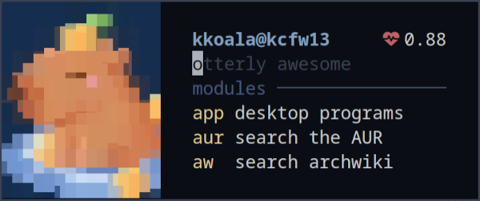

# otter-launcher


A very extensible app launcher, designed for keyboard-centric wm users. It is blazingly fast, supports vi and emacs keybinds, and can be decorated with ascii color codes, sixel or kitty image protocols. Plus, through bash scripting, system info widgets can be added to the infinity.

The concept is making these behaviours possible:

- type "gg margaret thatcher" to google the lady in a web browser
- "sh htop" to run htop in a terminal
- "dc linux" to search the word linux with an online dictionary
- "app" to launch application menu
- etc.

It's recommended to use otter-launcher with [sway-launcher-desktop](https://github.com/Biont/sway-launcher-desktop). Use your wm's window rules to control its window size. Also, some helper scripts can be found in the [contrib](https://github.com/kuokuo123/otter-launcher/tree/main/contrib) folder.

[Image Source: Artist Kat Corrigan & MWMO Stormwater Park](https://www.mwmo.org/learn/visit-us/exhibits/waterways-and-otterways/)


# Features

- modularized to run different commands (via configuration)
- vi and emacs keybinds
- tab completion for configured modules
- customizable shell by which programs are launched (sh -c, zsh -c, hyprctl dispatch exec, etc)
- url encoding for web searching
- decorated with ascii color codes, chafa, sixel or kitty image protocol, etc.
- loop mode
- cheatsheet for configured modules
- minimalist, blazing fast, keyboard-centric

# Installation

## Building from source

```
git clone https://github.com/kuokuo123/otter-launcher /tmp/otter-launcher
cd /tmp/otter-launcher
cargo build --release
sudo cp /tmp/otter-launcher/target/release/otter-launcher /usr/bin/
```

# Configuration

Otter-launcher reads a config file from $HOME/.config/otter-launcher/config.toml. If that file is missing, it looks into /etc/otter-launcher/config.toml

An example config file is at config_example/config.toml in this repo. Copy it to one of the above locations.

Also, check [more examples of module config](https://github.com/kuokuo123/otter-launcher/wiki) at the wiki page.

``` toml
[general]
default_module = "gg" # The module to run when no prefix is matched
empty_module = "app" # run with an empty prompt
exec_cmd = "sh -c" # The exec command of your shell, default to sh
# for example: "bach -c" for bash; "zsh -c" for zsh. This can also runs wm exec commands, like hyprctl dispatch exec
vi_mode = false # set true to use vi keybinds, false to use emacs keybinds; default to emacs
esc_to_abort = true # allow to quit pressing esc; a useful option for vi users
cheatsheet_entry = "?" # when entered, otter-launcher will show a list of configured modules
cheatsheet_viewer = "less -R" # the program that otter-launcher will pipe cheatsheet into
loop_mode = false # in loop mode, otter-launcher won't quit after running a module, and can be used with a scratchpad
#callback = "" # if set, otter-launcher will run the command after a module is executed; for example, it can call swaymsg to adjust window size


# ASCII color codes are allowed with these options. However, \x1b should be replaced with \u001B (unicode escape) because the rust toml crate cannot read \x as an escaped character...
[interface]
header_cmd = "" # Run a shell command and make the stdout printed above the header
header_cmd_trimmed_lines = 0 # Remove a number of lines from header_cmd output, in case of some programs printing excessive empty lines at the end of its output
# use three quotes to write longer commands
header = """
  \u001B[32m
  ░█▀█░▀█▀░▀█▀░█▀▀░█▀█░░░░░█░░░█▀█░█░█░█▀█░█▀▀░█░█
  ░█░█░░█░░░█░░█▀▀░█▀▄░▀▀▀░█░░░█▀█░█░█░█░█░█░░░█▀█
  ░▀▀▀░░▀░░░▀░░▀▀▀░▀░▀░░░░░▀▀▀░▀░▀░▀▀▀░▀░▀░▀▀▀░▀░▀
              ————————————————————————\u001B[0m
   \u001B[34m \u001B[0m otter-launcher \u001B[34m>\u001B[0m """
list_prefix = "      "
place_holder = "type and search..."
default_module_message = "" # if set, the text will be shown when the default module is in use
empty_module_message = "" # the text to show when empty module is in use
suggestion_mode = "list" # available options: list, hint
suggestion_lines = 3 # length of the suggestion list, set to 0 to disable suggestions and tab completion
suggestion_spacing = 0 # spacing between input field and suggestions
indicator_with_arg_module = "> " # a sign showing whether the module should run with an argument
indicator_no_arg_module = "< "
prefix_padding = 0 # format prefixes to have a unified width; prefixes will be padded with spaces to have a least specified number of chars
# below color options affect all modules; per-module coloring is allowed by using ascii color codes at each module's configurations
prefix_color = "\u001B[32m"
description_color = "\u001B[38m"
place_holder_color = "\u001B[30m"
hint_color = "\u001B[30m" # the color of hint mode suggestions


# Modules are defined as followed
[[modules]]
description = "search with google"
prefix = "gg"
cmd = "xdg-open 'https://www.google.com/search?q={}'"
with_argument = true # If "with_argument" is true, the {} in the cmd value will be replaced with user input. If the field is not explicitly set, will be taken as false.
url_encode = true # "url_encode" should be true if the module is set to call webpages, as this ensures special characters in url being readable to browsers. It'd better be false with shell scripts. If the field is not explicitly set, will be taken as false.

[[modules]]
description = "launch desktop applications with fzf"
prefix = "app"
cmd = """
desktop_file() {
find /usr/share/applications -name "*.desktop" 2>/dev/null
find /usr/local/share/applications -name "*.desktop" 2>/dev/null
find "$HOME/.local/share/applications" -name "*.desktop" 2>/dev/null
find /var/lib/flatpak/exports/share/applications -name "*.desktop" 2>/dev/null
find "$HOME/.local/share/flatpak/exports/share/applications" -name "*.desktop" 2>/dev/null
}
selected="$(desktop_file | sed 's/.desktop$//g' | sort | fzf -m -d / --with-nth -1 --reverse --padding 1,3 --prompt 'Launch Apps: ')"
[ -z "$selected" ] && exit
echo "$selected" | while read -r line ; do setsid -f gtk-launch "$(basename $line)"; done
"""

[[modules]]
description = "search github"
prefix = "gh"
cmd = "xdg-open https://github.com/search?q='{}'"
with_argument = true
url_encode = true

[[modules]]
description = "cambridge dictionary online"
prefix = "dc"
cmd = "xdg-open 'https://dictionary.cambridge.org/dictionary/english/{}'"
with_argument = true
url_encode = true

# fzf and fd are needed to run these functions
[[modules]]
description = "open files with fzf"
prefix = "fo"
cmd = "setsid -f $TERM --class fzf -e sh -c 'fd --type f | fzf | xargs -r xdg-open'"

[[modules]]
description = "open folders with fzf and yazi"
prefix = "yz"
cmd = "setsid -f $TERM --class yazi -e sh -c 'fd --type d | fzf | xargs -r $TERM -e yazi'"
```

# Examples for Styling

## Default Config File



```
[interface]
header = """
  \u001B[32m
  ░█▀█░▀█▀░▀█▀░█▀▀░█▀█░░░░░█░░░█▀█░█░█░█▀█░█▀▀░█░█
  ░█░█░░█░░░█░░█▀▀░█▀▄░▀▀▀░█░░░█▀█░█░█░█░█░█░░░█▀█
  ░▀▀▀░░▀░░░▀░░▀▀▀░▀░▀░░░░░▀▀▀░▀░▀░▀▀▀░▀░▀░▀▀▀░▀░▀
              ————————————————————————\u001B[0m
   \u001B[34m \u001B[0m otter-launcher \u001B[34m>\u001B[0m """
list_prefix = "      "
place_holder = "type and search..."
suggestion_mode = "list"
suggestion_lines = 3
prefix_color = "\u001B[32m"
description_color = "\u001B[38m"
place_holder_color = "\u001B[90m"
```

## Two-liner


```
[interface]
header = """
   \u001B[34m \u001B[0m otter-launcher \u001B[34m>\u001B[0m """
list_prefix = "   \u001B[31m #\u001B[0m "
place_holder = "type and search..."
suggestion_mode = "list"
suggestion_lines = 1
indicator_with_arg_module = ""
indicator_no_arg_module = ""
prefix_color = "\u001B[33m"
description_color = "\u001B[38m"
place_holder_color = "\u001B[30m"
```

## Pfetch Integration


```
[interface]
header_cmd = "echo ' '; pfetch"
header_cmd_trimmed_lines = 2
header = """
               \u001B[30m———\u001B[0m\u001B[31m———\u001B[0m\u001B[32m———\u001B[0m\u001B[33m———\u001B[0m\u001B[34m———\u001B[0m\u001B[35m———\u001B[0m\u001B[36m———\u001B[0m\u001B[37m———\u001B[0m
 \u001B[34m \u001B[0m otter-launcher \u001B[34m>\u001B[0m 
"""
list_prefix = "    "
place_holder = "type and search..."
suggestion_mode = "list"
suggestion_lines = 1
indicator_with_arg_module = ""
indicator_no_arg_module = ""
prefix_color = "\u001B[32m"
description_color = "\u001B[38m"
place_holder_color = "\u001B[30m"
```

## Fastfetch & Krabby Integration


```
[interface]
header_cmd = "fastfetch --structure break:colors:break:os:wm:kernel:uptime:packages:memory:datetime:break --key-type icon --logo-type data --logo \"$(krabby name quilava --no-title)\""
header_cmd_trimmed_lines = 1
header = " \u001B[34m \u001B[0m otter-launcher \u001B[34m>\u001B[0m "
list_prefix = "    "
place_holder = "type and search..."
suggestion_mode = "list"
suggestion_lines = 1
indicator_with_arg_module = ""
indicator_no_arg_module = ""
prefix_color = "\u001B[32m"
description_color = "\u001B[38m"
place_holder_color = "\u001B[30m"
```

## Image Protocol Integration (Sixel or Kitty) with CPU & MEM Indicators


```
[interface]
header_cmd = "chafa --fit-width /home/kkoala/.config/otter-launcher/ascii/waterways_and_otterways.jpg; echo -e \"   \u001B[34m  >\u001B[0m $USER@$HOSTNAME              \u001B[31m\u001B[0m $(mpstat | awk 'FNR ==4 {print $4}')%  \u001B[33m󰍛\u001B[0m $(free -h | awk 'FNR == 2 {print $3}')\""
header_cmd_trimmed_lines = 0
header = """      \u001B[34;1m>\u001B[0;1m """
list_prefix = "        "
place_holder = "type and search..."
indicator_with_arg_module = "\u001B[31m#>\u001B[0m "
indicator_no_arg_module = "\u001B[31m#!\u001B[0m "
default_module_message = """
        \u001B[35msearch\u001B[0m on the internet"""
suggestion_mode = "list"
suggestion_lines = 3
prefix_padding = 3
description_color = "\u001B[38m"
place_holder_color = "\u001B[90m"
hint_color = "\u001B[90m"
```
